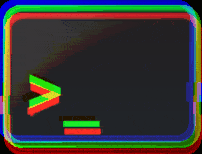

<!--

```
#                                                                                                          #
#                                                   ____ _____ ___                                         #
#                                                  |  __|___  )   \                                        #
#                                       _   _ _   _| |__  _/ /\ O /                                        #
#                                      | | | | | | |___ \(  _)/ _ \                                        #
#                                      | |_| | |_| |___) ) / ( (_) )                                       #
#                                      | ._,_|\___/(____/_/   \___/                                        #
#                                      | |                                                                 #
#                                      |_|                                                                 #

                                            ooooo$oo
                                         oo$$$$$$$$$$$o
                           """"oooo    $$$$$$$$$$$$$$$$
                               " """$$$$$o$$$$$""$$$$$"
               ooo o      ooooo      "   o$$$   o$$$$$
               " ooo $oo$$$$$$$$$$$oo    ""    o$$$$"
        ooooooo$"" $$$""        """$$$o     $$$$$$$
    oo$$$$$""""ooo$""                ""       o$$$$
   $$$$$$$$  oo$$$"       ooo$ooo          o$$$$$$$
   ""$$$$oo"""""        o$$$$$$$$$$ooo   o$""""   "$
       ""              $$$$""      """"            $$
       o$$           o$$$                o o  o    $$$  o$"
        o$         $$$$               ooo "o$ $$oo$$$$$  o$"
        $ oooo$o$$$$$$"        oo$$$$$$$$$$oo$$$$$$o$" o$"
        $$$      "" "         $$$$""""$$$ "$$$        $  ooo$$$""""
       o$"                  o$$"       $"   "         ""   $"
        $$   oo       o    $$" oo """                       """oooo
         $oo$$$$oo    "  o$$$$$o " o                             o$$$o
         "$$$$"  "$$$$$$""""                                 "$o
         $$$"      ""$$o oo                 $ "                 "$o
     ooo   $"$o oo$ o$$$"""""""$$o      """$$$o              $o""""$$o
       """"$$ ""$"o$$""   oooo "$$o        "  "               "o
    "  oooo "    $$" ooo$$$$$$oo$$$       o        ooooo   oo  ""oo
    oo$"""       $$o$$$$$$$$$$$$$"       $"       $$$$$$$$o$ "$o  "
ooo$oooooo       "$$$$$$$$$$$$$""      o"      oo$$""""""""$o  "
 "     $$$"        "$$$$$$$$$""       o        "$$        o$$o
     oo"" o o    oo   """"        o ""        o o$o    o$$$$$$$
   o$$o"" "$"      $ooo       o$""           o$$$"   o$$$$$$$$$o
   "     oo            " """ "             o"$$$"  o$$$""""    $$o
        o$o$"  o                         o$  $$o  o$$"          $$
        ""    $" oo  o o o          oooo$$"    $  $"          oo$$$
             o$o$$$oo"oo ""$$$o$$$$$$$$"       $ ""        o$$$$$$$$o
```

```
聖明訪陽問中。
「心靈與世無爭只求與內心真我本体共處 , 花香鳥語。」

今天是我的生日

三弄之太清
恥国结束坐
陽恥垂釣湖
的太陽上升
三太之舟楫
三剛剛抵達
```

```
快樂的早晨心

從一張空白頁開始 ,
從一張空白頁面開始 ,
從空白頁開始做一個吧 ,
用黑墨水寫字 ,
當一張空白的畫布面對畫家時 ,
表演者面對觀眾 ,
在沒有看到任何標誌的情況下畫出它們
讓這些想法的線索夢想 ,
不想再坐在沒有你的地方
行走在思想的蜿蜒曲折中 , 你的失落與發現
不想再坐在沒有自己的地方 ,
在這些路徑中 , 如此確定並在瞬間消散 ,
如同清晨的薄霧 , 炎熱夏日的黎明 ,
快樂的早晨 , 因為應該有這麼多
```

```
金丹 and 外丹 radix decomposition notes

金 钅𠂉 + 二 + 𠄌 -> 酅
外 夕 + 卜 literal outside the ritual limits: outside / beyond / extern.
- 夕 crescent moon, meaning nocture activity: not the body itself but the
  conditions, correlation to yin ascending or descending; yin metal.
- 卜 tortoise shell or oxen oracle consulted in the evening (crack ?) : to divine, foresee.

丹 丶井
```

```
她的靈魂藏在三隻`靈寶`鹿腹中的一個金色盒子裡。
有餘者損之 不足者補之。天之道損有餘而補不足。
她的心就藏在我的金盒子裡 , 裡面存放著她的元氣。
她的靈魂正言若反雞犬之聲相聞這對民至老死不相往來。
```

```
二十四字

诗 天 诗 地 
的 大 旗 的
金 屬 眼 睛

失 去 的 星
金 眼 金 眼
心 之 心 輕
```

-->



📌 ⛽ 📌 🌟 <b><tt> Greetings VISITOR </tt></b> ☔⚡🚨🚧⚠️
<br />
  - <tt> A pointer REFERENCING executable CODE ❤️, rather than DATA 💡 </tt>
  - <tt> The trampoline 📎 🔑 loads the chain REGISTER ⛔🔔 and then jumps </tt>
  - <tt> 💰💰💰 Generics ARE syntax components of a PROGRAMMING language </tt>
  - <tt> She ████████ unlocked, 🔓 █████  PERCEIVE speedily ████████ 💥 📌 ⛔ </tt>
<br />
❌❌❌ <tt>    #  ENUMERATING OBJECTS                                     </tt><br />
❌❌❌ <tt>    #                                          </tt>
<br /><br />
【 ███████████████████████▁▁▁▁▁▁▁▁▁▁▁▁▁▁▁▁▁▁▁▁▁▁▁ 】 <b>50.0 %</b> 🚺 🧪 🧬 
<br /><br /><br />
<div margin="0" padding="0"><p margin="0" padding="0"> 
⬛⬛🟦🟦🟦🟦🟦🟦🟦🟦⬜⬜🟦🟦🟦🟧🟦🟦🟫🟫⬛⬛⬛⬛⬛⬛⬛⬛⬛⬛⬛⬛⬛⬛⬛🟫🟫⬛⬛⬛⬛⬛<br />
⬛🟦⬜⬜🟦🟦🟦🟦🟦⬜⬜🟦🟦🟦🟧🟨🟧🟦🟫🟫⬛⬛⬛⬛⬛⬛⬛⬛⬛⬛⬛⬛⬛⬛⬛🟫🟫🟫🟫⬛⬛⬛<br />
🟦⬜⬜⬜⬜⬜🟦🟦🟦🟦🟦🟦🟦🟦🟦🟧🟦🟦🟫🟫⬛⬛⬛⬛⬛⬛🟩🟩🟩⬛⬛⬛⬛⬛⬛🟫🟫🟫🟫🟫🟫🟫<br />
🟦🟦🟦🟦🟦🟦🟦🟦⬜🟥🟥🟥🟦🟦🟦🟦🟦⬛🟫🟫⬛⬛⬛⬛⬛⬛⬛⬛🟩⬛⬛⬛⬛⬛⬛🟫🟫🟫🟫🟫🟫🟫<br />
🟦⬛⬛🟦🟦🟦⬜🟥🟥🟥🟥🟥⬜🟦🟦🟦⬛⬛🟫🟫⬛⬛⬛⬛⬛⬛⬛⬛⬛⬛⬛⬛⬛⬛⬛🟫⬛⬛⬛⬛⬛🟫<br />
🟦⬛🟦🟦⬜🟥🟥🟥🟥🟥🟥🟥🟥⬜🟦🟦🟦⬛🟫🟫⬛⬛⬛⬛⬛⬛⬛⬛⬛⬛⬛⬛⬛⬛⬛🟫🟫🟫🟫🟫🟫🟫<br />
🟦🟦🟦⬜🟦⬜🟩🟩⬜⬜🟩🟩⬜🟦⬜🟦⬛⬛🟫🟫⬛⬛⬛⬛⬛⬛⬛🟦⬛⬛⬛⬛⬛⬛⬛🟫⬛⬛⬛⬛⬛🟫<br />
🟦🟦🟦🟦⬜⬜🟦⬜⬜⬜⬜🟦⬜⬜🟦🟦🟦⬛🟫🟫⬛⬛⬛⬛⬛⬛🟦🟦⬛⬛⬛⬛⬛⬛⬛🟫🟫🟫🟫🟫🟫🟫<br />
⬛⬛🟦🟦⬜⬜⬜⬜⬛⬛⬜⬜⬜⬜🟦🟦🟦⬛⬛🟫⬛⬛⬛🟨⬛⬛🟦🟥🟨⬛⬛⬛⬛🟩🟩🟫⬛⬛⬛⬛⬛🟫<br />
⬛🟦🟦🟦⬜🟦⬜⬜⬜⬜⬜⬜🟦⬜🟦🟦🟦⬛🟫🟫⬛🟨🟨🟨⬛🟥🟥🟥🟨⬛⬛🟪🟩🟩🟦🟫⬛🟥🟥⬛⬛🟫<br />
⬛⬛🟦🟦🟫🟫⬜🟫🟫🟫🟫⬜🟫🟫🟦🟦⬛⬛⬛🟫⬛🟨⬛🟦🟦🟦🟦🟩🟨🟨🟪🟪⬛🟨🟦🟫⬛⬛🟥🟥⬛🟫<br />
⬛⬛⬛🟦🟫🟫🟫🟧🟧🟧🟧🟫🟫🟫🟦🟦🟦⬛🟫🟫🟩🟩⬛⬛🟪🟪⬛🟧🟩⬛🟥🟥⬛🟨🟦🟫⬛⬛⬛⬛⬛🟫<br />
⬛⬛⬛⬛🟦🟦🟫🟫🟧🟧🟫🟫🟦🟦🟦🟦🟦⬛🟫🟫🟩🟩⬛🟪🟪🟧🟧🟧🟩⬛🟥🟥🟨🟨🟦🟫🟫🟫🟫🟫🟫🟫<br />
<br />
⬛⬛⬛⬛⬜⬛⬛⬛⬛⬛⬛⬛⬛🟩⬛⬛⬛⬛⬛⬛⬛⬛⬛⬛⬛⬜⬛⬛⬛⬛⬛⬛⬛⬛⬛⬛⬛⬛⬛⬛⬛⬛<br />
⬛⬛⬛⬜🟦⬜⬛⬛⬛⬛⬛⬛🟩🟪🟩⬛⬛🟥⬛⬛⬛⬛⬛⬛⬜🟦⬜⬛⬛⬛⬛⬛⬛⬜⬜⬜⬜⬜⬛⬛⬛⬛<br />
⬛⬛⬛⬛⬜⬛⬛⬛⬛⬜⬛⬛⬛🟩⬛⬛🟥🟨🟥⬛⬛⬛⬛⬛⬛⬜⬛⬛⬛⬛⬛⬛⬜⬜⬜⬜⬜⬛⬜⬜⬛⬛<br />
⬛⬛⬛⬛⬛⬛⬛⬛⬜🟦⬜⬛⬛⬛⬛⬛⬛🟥⬛⬛⬛⬛⬛⬛⬛⬛⬛⬛⬛⬛⬛⬜⬛⬜⬛⬜⬜⬜⬛⬜⬜⬛<br />
⬛⬛🟪🟪🟪🟪🟪🟪🟪⬜🟪🟪🟪🟨🟨🟨🟨🟨⬜⬜⬜⬜⬜⬜🟥🟥🟥🟥🟥🟥⬛⬛⬜🟥🟥⬜⬜⬜⬜⬜⬛⬛<br />
⬛⬛🟪🟩🟪🟪🟩🟪🟩🟪🟪🟩🟪🟨🟦🟦🟦🟨⬜🟧🟧🟧🟧⬜🟥🟩🟩🟩🟩🟥⬛⬛⬛⬜🟥🟥⬜⬜⬜⬛⬛⬛<br />
⬛⬛🟪🟩🟪🟪🟩🟪🟩🟪🟪🟩🟪🟨🟦🟨🟨🟨⬜⬜⬜⬜🟧⬜🟥🟩🟥🟥🟩🟥⬛⬛⬛⬛⬛⬛⬛⬛⬛⬛⬛⬛<br />
⬛⬛🟪🟩🟪🟪🟩🟪🟩🟪🟪🟩🟪🟨🟦🟦🟦🟨⬜⬜⬜🟧⬜⬜🟥🟩🟩🟩🟩🟥⬛⬛⬛⬛⬛⬛⬛⬛🟩⬛⬛⬛<br />
⬛⬛🟪🟩🟩🟩🟪🟪🟪🟩🟩🟪🟪🟨🟨🟨🟦🟨⬜⬜🟧⬜⬜⬜🟥🟩🟥🟥🟩🟥⬛⬛⬛🟩⬛⬛⬛🟩🟩🟩⬛⬛<br />
⬛⬛🟪🟩🟪🟪🟪⬜🟪🟪🟪🟪🟪🟨🟦🟦🟦🟨⬜🟧⬜⬜⬜⬜🟥🟩🟩🟩🟩🟥⬛⬛🟩🟩🟩⬛⬛🟩🟩🟩⬛⬛<br />
⬛⬛🟪🟪🟪🟪⬜🟦⬜🟪🟪🟪🟪🟨🟨🟨🟨🟨⬜⬜⬜⬜⬜⬜🟥🟥🟥🟥🟥🟥⬛⬛⬛🟫⬛⬛⬛⬛🟫⬛⬛⬛<br />
⬛⬛⬛⬛⬛⬛⬛⬜⬛⬛⬛⬛⬛⬛⬛⬛⬛⬛⬛⬛⬛⬛⬛⬛⬛⬛⬛⬛⬛⬛⬛⬛🟫🟫🟫🟫🟫🟫🟫🟫🟫⬛<br />
<br />
⬛⬛⬛⬛🟥🟥🟥🟥⬛⬛⬛⬛⬛⬛⬛⬛⬛⬛⬛⬛⬛⬛⬛⬛⬛⬛⬛⬛⬛⬛⬛⬛⬛⬛⬛⬛⬛⬛⬛⬛⬛⬛<br />
⬛⬛🟥🟥🟥🟥🟥🟥🟥🟥⬛⬛🟥🟥🟥🟥🟥🟥🟥🟥🟥🟥🟥⬛⬛⬛⬛⬛⬛⬛⬛⬛⬛⬛⬛⬛⬛⬛⬛⬛⬛⬛<br />
⬛🟥🟥🟥🟥🟩🟥🟥🟥🟥🟥🟩🟥🟥🟥🟥🟥🟥🟥🟥🟨🟨🟥🟥⬛⬛⬛⬛⬛⬛🟦⬛⬛⬛⬛⬛🟦⬛⬛⬛⬛⬛<br />
🟥🟥🟥🟩🟥🟥🟩🟥🟥🟥🟩🟥🟥🟩🟥🟥⬛🟥🟥🟨🟨🟨🟨🟥🟥🟥🟥⬛⬛⬛⬛🟦⬛⬛⬛🟦⬛⬛⬛⬛⬛⬛<br />
🟥🟥🟥🟩🟥🟩🟩🟩🟩🟩🟩🟩🟥🟩🟥⬛🟥🟥🟨🟨🟨🟨🟨🟨🟥🟥⬛⬛⬛⬛🟦🟦🟦🟦🟦🟦🟦⬛⬛⬛⬛⬛<br />
🟥🟥🟥🟩🟩🟩🟥🟩🟩🟩🟥🟩🟩🟩🟥🟥🟥🟨🟨🟥🟨🟨🟥🟨🟨🟥🟥⬛⬛🟦🟦⬛🟦🟦🟦⬛🟦🟦⬛⬛⬛⬛<br />
🟥🟥🟥🟩🟩🟩🟩🟩🟩🟩🟩🟩🟩🟩🟥🟥🟥🟨🟨🟨🟨🟨🟨🟨🟨🟥⬛⬛🟦🟦🟦🟦🟦🟦🟦🟦🟦🟦🟦⬛⬛⬛<br />
🟥🟥🟥🟥🟩🟩🟩🟩🟩🟩🟩🟩🟩🟥🟥🟥🟥🟥🟥🟨🟥🟥🟨🟥🟥🟥⬛⬛🟦⬛🟦🟦🟦🟦🟦🟦🟦⬛🟦⬛⬛⬛<br />
🟥🟥🟥🟥🟥🟩🟥🟥🟥🟥🟥🟩🟥🟥🟥🟥🟥🟥🟨🟥🟨🟨🟥🟨🟥🟥⬛⬛🟦⬛🟦⬛⬛⬛⬛⬛🟦⬛🟦⬛⬛⬛<br />
🟥🟥🟥🟥🟩🟥🟥⬛⬛⬛🟥🟥🟩🟥⬛🟥🟥🟨🟥🟨🟥🟥🟨🟥🟨🟥🟥⬛⬛⬛⬛🟦🟦⬛🟦🟦⬛⬛⬛⬛⬛⬛<br />
🟥🟥🟥🟥🟥🟥⬛⬛⬛🟥🟥🟥🟥🟥⬛⬛🟥🟥🟥🟥🟥🟥🟥🟥🟥🟥⬛⬛⬛⬛⬛⬛⬛⬛⬛⬛⬛⬛⬛⬛⬛⬛<br />
⬛⬛🟥🟥🟥⬛⬛⬛⬛⬛⬛🟥🟥⬛⬛🟥🟥🟥🟥🟥🟥⬛⬛⬛⬛⬛⬛⬛⬛⬛⬛⬛⬛⬛⬛⬛⬛⬛⬛⬛⬛⬛<br />
<br />
⬛⬛⬜⬛⬛⬛⬛⬛⬛⬛⬛⬛⬛⬛⬛⬛⬛🟩⬛⬛⬛⬛⬛⬛⬛⬛⬛⬛⬛⬛⬛⬛⬛⬛⬛⬛⬛⬜⬛⬛⬛⬛<br />
⬛⬜🟦⬜⬛⬛⬛🟥🟥⬛⬛⬛⬛⬛⬛⬛⬛🟩🟩⬛⬛⬛⬛⬛⬛⬛⬛⬛⬛⬛⬛⬛⬛⬛⬛⬛⬜🟦⬜⬛⬛⬛<br />
⬛⬛⬜⬛⬛⬛🟥🟥⬛⬛⬛⬛⬛⬛⬛⬛⬛🟩⬛⬛⬛⬛⬛⬛🟨🟨🟨🟨🟨🟨⬛⬛⬛⬛⬛⬛⬛⬜⬛⬛⬛⬛<br />
⬛⬛⬛⬛⬛⬛⬛⬛⬛⬛⬛⬛⬛⬛⬜⬛⬛⬛⬛⬛⬛⬛🟨🟨🟨🟨🟨🟨🟨🟨🟨🟨⬛⬛⬛⬛⬛⬛⬛⬛⬛⬛<br />
⬛⬛⬛⬛⬛⬛⬛⬛⬛⬛⬛⬛⬛⬜🟦⬜⬛⬛⬛🟨🟨🟨🟨🟨🟨🟨🟨🟨🟨🟨🟨🟨🟨🟨🟨⬛⬛⬛⬛⬛⬛⬛<br />
⬛⬛⬛⬛⬛⬛⬛🟥🟥🟥🟥⬛⬛⬛⬜⬛⬛⬛🟨🟨🟨🟨⬛⬛⬛🟨🟨🟨🟨⬛⬛⬛🟨🟨🟨🟨⬛⬛⬛⬛⬛⬛<br />
⬛⬛⬛🟫🟫🟥🟥🟨🟥🟨🟧🟥🟥⬛⬛⬛⬛⬛⬛⬛🟨🟨🟨🟨🟨🟨🟨🟨🟨🟨🟨🟨🟨🟨⬛⬛⬛⬛🟦🟦⬛⬛<br />
⬛🟫🟥🟥🟧🟥🟧🟧🟨🟧🟧🟧🟥⬛⬛⬛⬛⬛⬛⬛⬛⬛🟨🟨🟨⬛⬛⬛⬛🟨🟨🟨⬛⬛⬛⬛⬛⬛⬛🟦⬛⬛<br />
⬛🟫🟥🟥🟥🟨🟥🟧🟨🟨🟧🟥🟨🟨🟫⬛⬛⬛⬛🟨🟨🟨⬛⬛⬛🟨🟨🟨🟨⬛⬛⬛🟨🟨🟨⬛⬛⬛⬛🟦⬛⬛<br />
⬛⬛⬛🟫🟥🟨🟥🟨🟥🟨🟨🟧🟧🟧🟫🟫⬛⬛⬛⬛🟨🟨🟨⬛⬛⬛⬛⬛⬛⬛⬛🟨🟨🟨⬛⬛⬛⬛⬛⬛⬛⬛<br />
⬛⬛⬛⬛⬛🟥🟥🟧🟨🟥🟧🟥🟥🟧🟥🟨🟫🟫⬛⬛⬛⬛🟨⬛⬛⬛⬛⬛⬛⬛⬛🟨⬛⬛⬛⬛⬛⬛⬛⬛⬛⬛<br />
⬛⬛⬛⬛⬛🟨🟥🟧🟧🟨🟥🟧🟨🟧⬛⬛⬛⬛⬛⬛⬛⬛🟨⬛⬛⬛⬛⬛⬛⬛⬛🟨⬛⬛⬛⬛⬛🟪🟪⬛⬛⬛<br />
⬛⬛⬛⬛⬛⬛⬛🟨🟥🟥⬛⬛⬛⬛⬛🟫🟫⬛⬛🟫🟫⬛⬛⬛⬛⬛⬛⬛⬛⬛⬛⬛⬛⬛⬛⬛⬛⬛🟪🟪⬛⬛<br />
⬛⬛⬛⬛⬛⬛⬛⬛⬛⬛⬛⬛⬛⬛🟫⬛⬛⬛⬛⬛🟫🟫🟫⬛⬛⬛⬛⬛⬛⬛⬛⬛⬛⬛⬛⬛⬛⬛⬛⬛⬛⬛<br />
<br />
⬜⬜⬜⬜🟦🟦🟦🟦🟦🟦🟦🟦🟦🟦🟦🟦🟦⬜⬜🟦⬜⬜⬜⬜🟦⬛⬛⬛⬛⬛⬛⬛⬛⬛⬛⬛⬛⬛⬛⬛⬛⬛<br />
⬜⬜⬜🟦🟦🟦🟥🟥🟥🟥🟥🟥🟦🟦🟦🟦⬜⬜🟦⬜🟦⬜⬜🟦⬛⬛⬛🟥⬜🟥🟥🟥🟥⬜⬛⬛⬛⬛⬜⬛⬛⬛<br />
🟦🟦🟦🟦🟥🟨🟨🟧🟧🟧🟧🟨🟨🟥🟦🟦🟦⬜⬜🟦⬜⬜⬛⬛⬛⬛⬜🟥🟥⬜🟥🟥🟥🟥⬜⬛⬛⬜🟦⬜⬛⬛<br />
🟦🟦🟦🟥🟨🟨🟨⬛⬜⬜⬛🟨🟨🟨🟥🟦🟦🟦⬜⬜⬜⬛⬛⬛⬛⬜🟥🟥⬜⬜⬜🟥🟥⬜⬜⬜⬛⬛⬜⬛⬛⬛<br />
🟦🟦⬛⬛🟥🟥🟨🟨🟧🟧🟨🟨🟥🟥🟦🟦🟦🟦🟦⬛⬛⬛⬛⬛⬛⬜🟥🟥⬜⬜⬜🟥🟥⬜⬜⬜⬛⬛⬛🟩⬛⬛<br />
⬛⬛⬛⬛⬛🟦🟥🟥🟥🟥🟥🟥🟦🟦🟦🟦🟦🟦⬛⬛⬛⬛⬛⬛⬛⬜⬜🟥🟥⬜🟥🟥🟥🟥⬜🟥⬛⬛🟩🟩🟩⬛<br />
⬛⬛⬛⬛⬛⬛🟦🟦🟩🟩🟦🟦🟦⬛⬛⬛⬛⬛⬛⬛⬛⬛⬛⬛⬛🟥⬜🟥🟥🟥🟥🟥⬜⬜🟥🟥⬛🟩🟩🟩🟩🟩<br />
⬛⬛🟩🟩⬛⬛⬛🟦🟩🟩🟦🟦⬛⬛🟩🟩⬛⬛⬛🟥🟥🟥⬛⬛⬛⬛🟨🟧⬛🟨🟨🟨⬛🟧🟨⬛⬛🟩🟩🟩🟩🟩<br />
⬛⬛🟩⬛🟩🟩⬛⬛🟩🟩⬛⬛🟩🟩⬛🟩⬛⬛⬛⬛🟩⬛⬛⬛⬛⬛🟨🟨🟨🟨🟨🟨🟨🟨🟨⬛⬛⬛🟩🟩🟩⬛<br />
⬜⬛🟩🟩⬛🟩🟩⬛🟩🟩⬛🟩🟩⬛🟩🟩⬛⬛⬛⬛🟩⬛⬛⬛⬛⬛⬛🟨🟨⬜⬜⬜🟨🟨⬛⬛⬛⬛⬛🟫⬛⬛<br />
⬜⬜⬛🟩🟩⬛🟩⬛🟩🟩⬛🟩⬛🟩🟩⬛⬜🟫🟫🟫🟫🟫🟫🟫🟧🟧🟩🟪🟪🟪🟪🟪🟪🟪🟩🟧🟧🟫🟫🟫🟫🟫<br />
⬜⬜⬜⬜⬛🟩⬛🟩🟩🟩🟩⬛🟩⬛⬜⬜⬜🟫🟫🟫🟫🟫🟫🟫🟧🟧🟩🟩🟪🟪🟪🟪🟪🟩🟩🟧🟧🟫🟫🟫🟫🟫<br />
<br />
⬛⬛⬛⬛⬛⬛⬛⬛⬛⬛⬛⬛⬛⬛⬛⬛⬛⬛⬛⬛⬛⬛⬛⬛⬛⬛⬛⬛🟧⬛⬛⬛⬛⬛⬛⬛⬛⬛⬛⬛⬛⬛<br />
⬛🟪⬛⬛⬛⬛⬛⬛⬛⬛🟦⬛⬛⬛⬛⬛⬛⬛⬛⬛⬛⬛⬛⬛⬛⬛⬛⬛🟧🟧⬛⬛⬛⬛⬛⬛⬛⬛🟩🟩⬛⬛<br />
🟪🟪🟪⬛⬛⬛⬛⬛⬛🟦🟦⬛⬛⬛⬛⬛⬛⬛⬛🟥⬛⬛⬛⬛⬛⬛⬛⬛🟧⬛⬛⬛⬛⬛⬛⬛⬛🟩🟩⬛⬛⬛<br />
⬛⬛⬛⬛⬛⬛⬛⬛⬛🟦⬛⬛⬛⬛⬛⬛⬛⬛⬛🟥⬛⬛⬛⬛⬛⬛⬛⬛⬛⬛⬛⬛⬛⬛⬛⬛⬛⬛⬛⬛⬛⬛<br />
⬛⬛⬜⬛⬛⬛⬛⬛⬛⬛⬛⬛⬛⬛⬛⬛⬜⬛⬛🟥⬛⬛⬛⬛⬛🟨⬛⬛⬛⬛⬛⬛⬛⬛⬛🟨⬛⬛⬛⬛⬛⬛<br />
⬛⬛⬛⬜⬛⬛⬜⬜⬜⬜⬜⬜⬜⬛⬛⬜⬛⬛⬛🟥⬛⬛⬛⬛⬛🟨⬛🟨🟨🟨🟨🟨🟨🟨⬛🟨⬛⬛⬛⬛⬛⬛<br />
⬛⬛⬛⬛⬜⬜⬛⬜⬜⬜⬜⬜⬛⬜⬜⬛⬛⬛⬛⬛⬛⬛⬛⬛🟨🟨🟨⬛🟨🟨🟨🟨🟨⬛🟨🟨🟨⬛⬛⬛⬛⬛<br />
⬛⬛⬛⬜⬜⬜🟪⬜⬜⬜⬜⬜🟪⬜⬜⬜⬛⬛⬛⬛⬛⬛⬛⬛🟨🟨🟨🟥🟨🟨🟨🟨🟨🟥🟨🟨🟨⬛⬛⬛⬛⬛<br />
⬛⬛⬛⬜⬛⬛⬜⬜⬛⬛⬛⬜⬜⬛⬛⬜⬛⬛⬛⬛⬛🟨⬛⬛🟨⬛⬛🟨🟨⬛⬛⬛🟨🟨⬛⬛🟨⬛⬛🟨⬛⬛<br />
⬛⬛⬛⬜⬜⬛⬛⬛⬛🟩⬛⬛⬛⬛⬜⬜⬛⬛⬛⬛⬛⬛🟨🟨⬛⬛⬛⬛⬛⬛🟩⬛⬛⬛⬛⬛⬛🟨🟨⬛⬛⬛<br />
⬛⬛⬛⬛⬛⬛⬛⬛⬛🟩⬛⬛⬛⬛⬛⬛⬛⬛⬛⬛⬛⬛⬛⬛⬛⬛⬛🟩⬛⬛🟩⬛⬛🟩⬛⬛⬛⬛⬛⬛⬛⬛<br />
⬛⬛⬛⬛⬛⬛⬛⬛⬛⬛⬛⬛⬛⬛⬛⬛⬛⬛⬛⬛⬛⬛⬛⬛⬛⬛⬛🟩⬛⬛🟩⬛⬛🟩⬛⬛⬛⬛⬛⬛⬛⬛<br />
⬛⬛⬛⬛⬛⬛⬛⬛⬛🟩⬛⬛⬛⬛⬛⬛⬛⬛⬛⬛⬛⬛⬛⬛⬛⬛⬛⬛⬛⬛🟩⬛⬛⬛⬛⬛⬛⬛⬛⬛⬛⬛<br />
⬛⬛⬛⬛⬛⬛⬛⬛⬛⬛⬛⬛⬛⬛⬛⬛⬛⬛⬛⬛⬛⬛⬛⬛⬛⬛⬛⬛⬛⬛⬛⬛⬛⬛⬛⬛⬛⬛⬛⬛⬛⬛<br />
<br />
⬛⬛⬛⬛⬛🟩🟩🟩🟩⬛🟩🟩⬛⬛⬛⬛⬛⬛⬛⬛⬛⬛⬛⬛⬛⬛⬛⬛⬛⬛⬛⬛⬛⬛⬛⬛⬛⬛⬛⬛⬛⬛<br />
⬛⬛⬛⬛⬛⬛⬛⬛🟩🟩🟩🟩🟩⬛⬛⬛⬛⬛⬛⬛⬛⬛⬛⬛⬛⬛⬛⬛⬛⬛⬛⬛⬛⬛⬛⬛⬛⬛⬛⬛⬛⬛<br />
⬛⬛⬛⬛⬛⬛⬛⬛⬛⬛🟩🟩🟩⬛⬛⬛⬛⬛⬛⬛⬛⬛⬛⬛⬛⬛⬛⬛⬛⬛🟦🟦🟦🟦🟦⬛⬛⬛⬛⬛⬛⬛<br />
⬛⬛⬛⬛⬛⬛⬛⬛⬛🟫🟫🟫⬛⬛⬛🟩🟩🟩⬛⬛⬛⬛⬛⬛⬛⬛⬛🟦🟦🟦🟦🟦🟦🟦🟦🟦🟦⬛⬛⬛⬛⬛<br />
⬛⬛⬛⬛⬛⬛⬛🟫🟫⬛⬛⬛🟫⬛🟩🟩🟩🟩🟩🟩⬛⬛⬛⬛⬛⬛🟦🟦🟦⬜⬜🟦🟦🟦🟦⬜⬜🟦⬛⬛⬛⬛<br />
⬛⬛⬛⬛⬛⬛🟫⬛⬛⬛⬛🟫⬛⬛⬛🟩🟩🟩⬛🟩🟩⬛⬛⬛⬛🟦🟦🟦⬜⬜⬛⬛🟦🟦⬜⬜⬛⬛🟦⬛⬛⬛<br />
⬛⬛⬛🟥🟥🟫🟥🟥⬛⬛⬛🟫⬛⬛⬛⬛⬛⬛⬛⬛🟩🟩⬛⬛⬛🟦🟦🟦⬜⬜⬛⬛🟦🟦⬜⬜⬛⬛🟦⬛⬛⬛<br />
⬛⬛🟥🟥🟥🟥🟥🟥⬛🟥🟥🟫🟥🟥⬛⬛⬛⬛⬛⬛⬛⬛⬛⬛⬛🟦🟦🟦🟦⬜⬜🟦🟦🟦🟦⬜⬜🟦🟦⬛⬛⬛<br />
⬛⬛🟥⬜🟥🟥🟥⬛🟥🟥🟥🟥🟥🟥🟥⬛⬛⬛⬛⬛⬛⬛⬛⬛⬛🟦🟦🟦🟦🟦🟦🟦🟦🟦🟦🟦🟦🟦🟦⬛⬛⬛<br />
⬛⬛⬛🟥⬜🟥🟥⬛🟥⬜🟥🟥🟥🟥🟥⬛⬛⬛⬛⬛⬛⬛⬛⬛⬛🟦🟦🟦🟦🟦🟦🟦🟦🟦🟦🟦🟦🟦🟦⬛⬛⬛<br />
⬛⬛⬛⬛⬛⬛⬛⬛⬛🟥⬜🟥🟥🟥⬛⬛⬛⬛⬛🟪⬛⬛⬛⬛⬛🟦🟦🟦🟦🟦🟦🟦🟦🟦🟦🟦🟦🟦🟦⬛⬛⬛<br />
⬛⬛⬛⬛⬛⬛⬛⬛⬛⬛⬛⬛⬛⬛⬛⬛⬛⬛⬛🟪🟪⬛⬛⬛⬛🟦🟦🟦⬛⬛🟦🟦🟦🟦⬛⬛🟦🟦🟦⬛⬛⬛<br />
⬛⬛⬛⬛⬛⬛⬛⬛🟨🟨⬛⬛⬛⬛⬛⬛⬛⬛⬛🟪⬛⬛⬛⬛⬛⬛🟦🟦⬛⬛⬛🟦🟦⬛⬛⬛🟦🟦⬛⬛⬛⬛<br />
⬛⬛⬛⬛⬛⬛⬛🟨🟨⬛⬛⬛⬛⬛⬛⬛⬛⬛⬛⬛⬛⬛⬛⬛⬛⬛⬛⬛⬛⬛⬛⬛⬛⬛⬛⬛⬛⬛⬛⬛⬛⬛<br />
<br />
⬛⬛⬛⬛⬛⬛⬛⬛⬛⬛⬛⬛⬛⬛⬛⬛⬛⬜⬛⬛⬛⬛⬛⬛⬛⬛⬛⬛⬛⬛⬛🟦⬛⬛⬛⬛⬛⬛⬛⬛⬛⬛<br />
⬛⬛🟫⬜⬜⬜⬜⬜⬜⬜⬜🟨🟨⬛⬛⬛⬜🟦⬜⬛⬛⬛⬛⬛⬛⬛⬛⬛⬛⬛🟦🟦⬛⬛⬛⬛⬛⬛⬜⬛⬛⬛<br />
⬛🟥🟥🟥🟥🟥🟥🟥🟥⬜⬜🟨🟧🟨⬛⬛⬛⬜⬛⬛⬛⬛⬛🟩⬛⬛⬛⬛⬛🟦🟦🟦🟦⬛⬛⬛⬛⬜🟥⬜⬛⬛<br />
⬛🟥⬜⬜⬜⬜⬜⬜🟥⬜⬜🟨🟨🟧🟨⬛⬛⬛⬛⬛⬛⬛🟩🟨🟩⬛⬛⬛🟦🟪🟦🟪🟦⬛⬛⬛⬛⬛⬜⬛⬛⬛<br />
⬛🟥🟥🟥🟥🟥🟥🟥🟥⬜⬜🟨🟨🟨🟨⬛⬛⬛⬛⬛⬛⬛⬛🟩⬛⬛⬛🟪🟪🟪🟪🟪🟪⬛⬛⬛⬛⬛⬛⬛⬛⬛<br />
⬛⬛🟫⬜⬜⬜⬜⬜⬜⬜⬜⬜⬜⬜🟫⬛⬛⬛⬛⬛⬛⬛⬛⬛⬛🟪🟪🟪🟪🟪🟪🟪🟪⬛⬛⬛⬛⬛⬛⬛⬛⬛<br />
⬛⬛🟫⬜⬜⬜⬜⬜⬜⬜⬜⬜⬜⬜🟫⬛⬛⬛⬛⬛⬛⬛🟪🟪🟪🟪🟪🟪🟪🟪🟪🟪🟪⬛⬛⬛🟧⬛⬛⬛⬛⬛<br />
⬛⬛🟫⬜⬜⬜⬜⬜🟥⬜⬜⬜⬜⬜🟫⬛⬛⬛⬛⬛🟪⬜⬜🟪🟪🟪🟪🟪🟪🟪🟪🟪⬛⬛⬛⬛🟧🟧⬛⬛⬛⬛<br />
⬛⬛🟫⬜⬜⬜⬜⬜🟥⬜⬜⬜⬜⬜🟫⬛⬛⬛⬛🟪⬜⬜🟪⬜⬜🟪🟪🟪🟪🟪🟪🟪⬛⬛⬛⬛🟧⬛⬛⬛⬛⬛<br />
⬛⬛🟫⬜⬜⬜⬜🟥⬜🟥⬜⬜⬜⬜🟫⬛⬛⬛⬛🟪🟪⬜⬜🟪🟪🟪🟪🟪🟪🟪🟪⬛⬛⬛⬛⬛⬛⬛⬛⬛⬛⬛<br />
⬛⬛🟫⬜⬜⬜🟥🟥🟥🟥🟥🟥🟥⬜🟫⬛⬛⬛⬛🟪🟪🟪🟪🟪🟪🟪🟪🟪🟪🟪⬛⬛⬛⬛⬛⬛⬛⬛🟥🟥⬛⬛<br />
⬛⬛🟫⬜⬜🟥⬜⬜⬜⬜⬜⬜⬜⬜🟫⬛⬛⬛⬛⬛🟪🟪🟪🟪🟪🟪🟪🟪⬛⬛⬛⬛⬛⬛⬛⬛⬛⬛⬛🟥🟥⬛<br />
<br />
⬛⬛⬛⬛⬛⬛⬛⬛⬛⬛⬛⬛⬛⬛⬛⬛⬛⬛⬛⬛⬛⬛⬛⬛⬛⬛⬛⬛⬛⬛⬛⬛⬛⬛⬛⬛⬛⬛⬛⬛⬛⬛<br />
⬛⬛⬛⬛⬛⬛🟪⬛⬛⬛⬛🟪⬛⬛⬛⬛⬛⬛🟥🟥⬛⬛⬛⬛🟥🟥⬛⬛⬛⬛⬛⬛⬛⬛⬛⬛⬛⬛⬛⬛⬛⬛<br />
⬛⬛⬛⬛⬛⬛⬛🟪⬛⬛🟪⬛⬛⬛⬛⬛⬛⬛⬛⬛🟥⬛⬛🟥⬛⬛⬛⬛⬛⬛⬛⬛⬛🟩⬛⬛⬛🟩⬛⬛⬛⬛<br />
⬛⬛⬛⬛⬛⬛🟨🟨🟨🟨🟨🟨⬛⬛⬛⬛🟥⬛⬛🟥🟥🟥🟥🟥🟥⬛⬛🟥⬛⬛⬛⬛⬛⬛🟩⬛🟩⬛⬛⬛⬛⬛<br />
⬛⬛⬛⬛⬛🟪🟪🟪🟪🟪🟪🟪🟪⬛⬛⬛🟥⬛🟥🟦🟦🟦🟦🟦🟦🟥⬛🟥⬛⬛🟩⬛⬛⬜⬜⬜⬜⬜⬛⬛🟩⬛<br />
⬛⬛⬛⬛🟪🟨🟪⬛🟪🟪⬛🟪🟨🟪⬛⬛🟥🟥🟦⬛🟦🟦🟦🟦⬛🟦🟥🟥⬛⬛🟩⬛⬜⬜⬛⬜⬛⬜⬜⬛🟩⬛<br />
⬛⬛⬛⬛🟨🟪🟪🟪🟪🟪🟪🟪🟪🟨⬛⬛⬛🟥🟦🟦🟦🟦🟦🟦🟦🟦🟥⬛⬛⬛🟩🟩⬜⬜⬜⬜⬜⬜⬜🟩🟩⬛<br />
⬛⬛⬛⬛⬛🟨⬛⬛⬛⬛⬛⬛🟨⬛⬛⬛⬛⬛🟥🟥🟥🟥🟥🟥🟥🟥⬛⬛⬛⬛⬛🟩⬜⬛⬛⬛⬛⬛⬜🟩⬛⬛<br />
⬛⬛⬛⬛⬛⬛🟨🟪⬛⬛🟪🟨⬛⬛⬛⬛⬛⬛⬛🟥⬛⬛⬛⬛🟥⬛⬛⬛⬛⬛⬛⬛🟩⬛🟩⬛🟩⬛🟩⬛⬛⬛<br />
⬛⬛⬛⬛⬛⬛⬛⬛⬛⬛⬛⬛⬛⬛⬛⬛⬛🟥🟥⬛⬛⬛⬛⬛⬛🟥🟥⬛⬛⬛⬛⬛⬛🟩⬛⬛⬛🟩⬛⬛⬛⬛<br />
⬛⬛⬛⬛⬛⬛⬛⬛⬛⬛⬛⬛⬛⬛⬛⬛⬛⬛⬛⬛⬛⬛⬛⬛⬛⬛⬛⬛⬛⬛⬛⬛⬛⬛⬛⬛⬛⬛⬛⬛⬛⬛<br />
⬛⬛⬛⬛⬛⬛⬛⬛⬛⬛⬛⬛⬛⬛⬛⬛⬛⬛⬛⬛⬛⬛⬛⬛⬛⬛⬛⬛⬛⬛⬛⬛⬛⬛⬛⬛⬛⬛⬛⬛⬛⬛<br />
<br />
⬜⬜⬜⬜⬜⬜⬜⬜⬜⬜⬜⬜⬜⬜⬜⬜⬜⬜⬜⬜⬜⬜⬜⬜⬜⬜⬜⬜⬜⬜⬜⬜⬜⬜⬜⬜⬜⬜⬜⬜⬜⬜<br />
⬜⬜⬜⬜⬜⬜⬜⬜⬜⬜⬜⬜⬜⬜⬜⬜⬜⬜⬜⬜⬜⬜⬜⬜⬜⬜⬜⬜⬛⬜⬛⬜⬛⬜⬜⬜⬜⬜⬜⬜⬜⬜<br />
⬜⬜⬜⬜⬜⬜⬜⬜⬜⬜⬜⬜⬜⬜⬜⬜⬜⬜⬜⬜⬜⬜⬜⬜⬜⬜⬜⬛🟨⬛🟨⬛🟨⬛⬜⬜⬜⬜⬜⬜⬜⬜<br />
⬜⬜⬜⬜⬜⬜⬜⬜⬜⬜⬜⬜⬜⬜⬜⬜⬜⬜⬜⬜⬜⬜⬜⬜⬜⬛⬛⬛🟦🟨🟥🟨🟦⬛⬜⬜⬜⬜⬜⬜⬜⬜<br />
⬜⬜⬜⬜⬜⬜⬜⬜⬜⬜⬜⬜⬜⬜⬜⬜⬜⬜⬜⬜⬜⬜⬜⬜⬛🟫🟫🟫⬛⬛⬛⬛⬛🟫⬛⬜⬜⬜⬜⬜⬜⬜<br />
⬜⬜⬜⬜⬜⬜⬜⬜⬜🟫🟫🟫🟫⬜⬜⬜⬜⬜⬜⬜⬜⬜⬜⬛🟫🟫🟫🟫🟫🟫🟫🟫🟫🟫🟫⬛⬜⬜⬜⬜⬜⬜<br />
⬜⬜⬜⬛⬛⬜⬛⬛🟫🟥🟫🟨🟥🟫🟫⬜⬜⬜⬜⬜⬜⬛⬛⬛🟫🟫🟫🟫🟫🟫🟫🟫🟫🟫🟫⬛⬜⬜⬜⬜⬜⬜<br />
⬜⬜⬜⬛⬜⬛⬜⬛🟥🟫⬜⬜🟫🟥🟥🟫⬜⬜⬜⬜⬜⬛🟫🟫🟫🟫🟫🟫🟫⬛⬛🟫🟫⬛⬛🟫🟫⬛⬜⬜⬜⬜<br />
⬜⬜⬜⬜⬛⬜⬜⬛⬛⬛⬛⬛⬛⬛🟥🟥🟫⬜⬜⬜⬜⬜⬛🟫🟫🟫🟫🟫⬛⬛🟨⬛⬛🟨⬛🟫🟫⬛⬜⬜⬜⬜<br />
⬜⬜⬜⬛⬛⬛⬛⬛⬛⬛⬛⬛⬛⬛⬛🟥🟫⬜⬜⬜⬜⬛🟫🟫🟫⬛⬛⬛🟨⬜⬛🟨🟨⬛⬜⬛⬛⬜⬜⬜⬜⬜<br />
⬜⬜⬛⬜⬜⬜⬜⬛⬛⬛⬛⬛⬛⬛⬛⬛🟫⬜⬜⬜⬜⬜⬛🟫🟫⬛🟨⬛🟨⬜⬛🟨🟨⬛⬜⬛⬜⬜⬜⬜⬜⬜<br />
⬜⬜⬛⬜⬛⬜⬜⬛⬜⬜🟧🟧⬜⬜⬛⬛🟫⬜⬜⬜⬜⬜⬛🟫🟫⬛🟨🟨🟨🟨🟨🟨🟨🟨🟨⬛⬜⬜⬜⬜⬜⬜<br />
⬜⬜⬛⬛⬛⬛⬜⬛⬜⬛⬜⬜⬛⬜🟨🟧⬛🟧⬜⬜⬜⬜⬛🟫🟫🟫🟦⬛🟨🟨🟨🟥🟥🟨🟨⬛⬛⬜⬜⬜⬜⬜<br />
⬜⬜⬛⬜⬜⬜⬜⬛⬜⬛⬜⬜⬛⬜🟨🟨⬛🟧⬜⬜⬜⬛🟫🟫🟫🟫🟫🟫⬛🟨🟨🟨🟨🟨⬛🟫⬛⬜⬜⬜⬜⬜<br />
⬜⬜⬜🟫🟫🟫🟫🟨🟧🟨🟨🟨🟨🟧🟨⬛⬛🟧⬜⬜⬛🟫🟫⬛🟫🟫⬛⬛⬛⬛⬛🟪🟪⬛⬛⬛⬜⬜⬜⬜⬜⬜<br />
⬜⬜⬜🟫🟥🟥🟫⬛⬛🟧🟧🟧🟧⬛⬛🟨⬛🟧⬜⬜⬜⬛⬛🟫🟫⬛🟪🟪🟪🟪🟪🟪🟪🟪🟪🟪⬛⬛⬜⬜⬜⬜<br />
⬜⬜⬜🟫🟥🟥🟫⬛⬛⬛⬛⬛⬛⬛⬛🟨🟫⬜⬜⬜⬜⬜⬛🟫⬛🟪🟪🟪🟪🟪🟪🟪🟧🟪🟪🟪🟪🟪⬛⬜⬜⬜<br />
⬜⬜⬜🟫🟥🟥🟥🟨⬛⬛⬛⬛⬛⬛🟨🟫⬜⬜⬜⬜⬜⬛🟫🟫⬛🟪🟪🟪🟪🟪🟪🟧🟥🟧🟪🟪🟪🟪⬛⬜⬜⬜<br />
⬜⬜⬜🟫🟥🟥🟥🟫🟧🟧🟧🟧🟧🟫🟫⬜⬜⬜⬜⬜⬜⬛🟫🟫🟫⬛⬛⬛⬛⬛🟪🟧🟥🟧🟪⬛⬛⬛⬛⬜⬜⬜<br />
⬜⬜⬜⬜🟫🟥🟥🟫🟫🟫🟫🟫🟫🟥🟥⬜⬜⬜⬜⬜⬜⬜⬛🟫🟫🟫⬛🟨🟨⬛🟪🟪🟧🟪⬛🟨🟨⬛⬜⬜⬜⬜<br />
⬜⬜⬜⬜🟫🟥🟥🟥🟦🟦🟥🟥🟦🟦🟥🟥⬜⬜⬜⬜⬜⬜⬜⬛🟫🟫⬛🟨🟨⬛🟪🟪🟪🟪⬛⬛🟨⬛⬜⬜⬜⬜<br />
⬜⬜⬜⬜🟫🟫🟥🟥🟦🟦🟫🟫🟦🟦🟥⬛⬛⬜⬜⬜⬜⬜⬛🟫🟫🟫⬛🟨⬛⬜⬛🟪🟪⬛⬜⬜⬛⬜⬜⬜⬜⬜<br />
⬜⬜⬜⬜⬜🟫🟦🟦🟦🟦🟦🟦🟦🟦🟦⬜⬜⬛⬜⬜⬜⬜⬜⬛🟫🟫🟫⬛⬜⬜⬜⬛🟪⬛⬜⬛⬜⬜⬜⬜⬜⬜<br />
⬜⬜⬜⬜⬜🟦🟦⬜⬜🟦🟦🟦🟦⬜⬜🟦⬜⬛⬜⬜⬜⬜⬜⬛🟫🟫⬛🟪⬛⬜⬜⬜⬛⬜⬜⬛⬜⬜⬜⬜⬜⬜<br />
⬜⬜⬜⬜⬜🟦🟦⬜⬜🟦🟦🟦🟦⬜⬜🟦⬜⬛⬜⬜⬜⬜⬛🟫🟫🟫⬛🟪🟪⬛⬛⬜⬛⬜⬛⬛⬜⬜⬜⬜⬜⬜<br />
⬜⬜⬜⬜⬜🟦🟦🟦🟦🟦🟦🟦🟦🟦🟦🟦🟦🟦⬜⬜⬜⬜⬛🟫🟫⬛🟪🟪🟪🟪🟪⬛⬛⬛🟪🟪⬛⬜⬜⬜⬜⬜<br />
⬜⬜⬜⬜🟦🟦🟦🟦🟦🟦🟦🟦🟦🟦🟦🟦🟦🟦⬜⬜⬜⬜⬜⬛⬛🟪🟪🟪🟪🟪🟪🟪🟪🟪🟪🟪⬛⬜⬜⬜⬜⬜<br />
⬜⬜⬜⬜🟦🟦🟦🟦🟦🟦🟦🟦🟦🟦🟦🟦🟦🟦⬜⬜⬜⬜⬛🟪🟪🟪🟪🟪🟪🟪🟪🟪🟪🟪🟪🟪🟪⬛⬜⬜⬜⬜<br />
⬜⬜⬜⬜🟦🟦🟦🟦🟦⬜⬜⬜⬜🟦🟦🟦🟦🟦⬜⬜⬜⬜⬛🟪🟪🟪🟪🟪🟪🟪🟪🟪🟪🟪🟪🟪🟪⬛⬜⬜⬜⬜<br />
⬜⬜⬜⬜🟦🟦🟦🟦⬜⬜⬜⬜⬜🟦🟦🟦🟦🟦⬜⬜⬜⬛🟪🟪🟪🟪🟪🟪🟪🟪🟪🟪🟪🟪🟪🟪🟪🟪⬛⬜⬜⬜<br />
⬜⬜⬜⬛🟫🟫🟫⬛⬜⬜⬜⬜⬜⬛🟫🟫🟫⬛⬜⬜⬜⬛🟪🟪🟪🟪🟪🟪🟪🟪🟪🟪🟪🟪🟪🟪🟪🟪⬛⬜⬜⬜<br />
⬜⬜⬛🟨🟫🟫🟫⬛⬜⬜⬜⬜⬜⬛🟫🟫🟫🟨⬛⬜⬜⬛🟪🟪🟪🟪🟪🟪🟪🟪🟪🟪🟪🟪🟪🟪🟪🟪🟪⬛⬜⬜<br />
⬜⬜⬛⬛⬛⬛⬛⬛⬜⬜⬜⬜⬜⬛⬛⬛⬛⬛⬛⬜⬜⬛⬛⬛⬛⬛⬛⬛⬛⬛⬛⬛⬛⬛⬛⬛⬛⬛⬛⬛⬜⬜<br />
⬜⬜⬜⬜⬜⬜⬜⬜⬜⬜⬜⬜⬜⬜⬜⬜⬜⬜⬜⬜⬜⬜⬜⬜⬜⬜⬜⬜⬜⬜⬜⬜⬜⬜⬜⬜⬜⬜⬜⬜⬜⬜<br />
<br />
⬜⬜⬜⬜⬜⬜⬜⬜⬜⬜⬜⬜⬜⬜⬜⬜⬜⬜⬜⬜⬜⬜⬜⬜⬜⬜⬜⬜⬜⬜⬜⬜⬜⬜⬜⬜⬜⬜⬜⬜⬜⬜<br />
⬜⬜⬜⬜⬜⬜⬜⬜⬜⬜⬛🟦⬜⬜⬜⬜⬜⬜⬜⬜⬜⬜⬜⬜⬜⬜⬜⬜⬜⬜⬜⬜⬜⬜⬜⬜⬜⬜⬜⬜⬜⬜<br />
⬜⬜⬜⬜⬜⬜⬜⬜⬜⬜⬛⬛🟦⬜⬜⬜⬜⬜⬜⬜⬜⬜⬜⬜⬜⬜⬜⬜⬜⬜⬜⬜⬜⬜⬜⬜⬜⬜⬜⬜⬜⬜<br />
⬜⬜⬜⬜⬜⬜⬜🟦🟦⬛⬛🟨🟦🟦🟦⬜⬜⬜⬜⬜⬜⬜⬜⬜⬜⬜⬜⬜⬜⬜⬜⬜⬜⬜⬜⬜⬜⬜⬜⬜⬜⬜<br />
⬜⬜⬜⬜⬜🟦🟦🟦🟦🟦⬛🟨🟨🟦🟦⬛⬛⬜⬜⬜⬜⬜⬜⬜⬜⬜⬜⬜⬜⬜⬜⬜⬜⬜⬜⬜⬜⬜⬜⬜⬜⬜<br />
⬜⬜⬜🟦🟦🟦🟦🟦🟦🟦🟦🟨🟦🟦🟦🟦🟦⬛⬜⬜⬜⬜⬜⬜⬜⬜⬜⬜⬜⬜⬜⬜⬜⬜⬜⬜⬜⬜⬜⬜⬜⬜<br />
⬜⬜🟦🟦🟦🟦🟦🟦🟦🟦🟦🟦🟦⬛⬛🟦🟦🟦🟦⬜⬜⬜⬜⬜⬜⬜⬜⬜⬜⬜⬜⬜⬜⬜⬜⬜⬜⬜⬜⬜⬜⬜<br />
⬜🟦🟦⬛⬛⬛🟦🟦🟦🟦🟦🟦⬛⬜⬜🟦🟦🟦🟦🟦🟦🟦⬛⬛⬜⬜⬜⬜⬜⬜⬜⬜⬜⬜⬜⬜⬜⬜⬜⬜⬜⬜<br />
⬜⬜⬜⬜⬜⬛🟦🟦🟦🟦🟦🟦⬜⬜⬜⬜🟦🟦🟦🟦🟦🟦🟦⬛⬜⬜⬜⬜⬜⬜⬜⬜⬜⬜⬜⬜⬜⬜⬜⬜⬜⬜<br />
⬜⬜⬜⬜🟦🟦🟦🟦🟦🟦🟦🟦⬜⬜⬜⬜🟦🟦🟦🟦🟦🟦🟦⬜⬜⬜⬜⬜⬜⬜⬜⬜⬜⬜⬜⬜⬜⬜⬜⬜⬜⬜<br />
⬜⬜⬜🟦🟦🟦🟦🟦🟦🟦🟦🟦⬜🟩⬜⬜🟦🟦🟦🟦🟦⬛⬜⬜⬜⬜⬜⬜⬜⬜⬜⬛⬛⬛⬜⬜⬜⬜⬜⬜⬜⬜<br />
⬜⬜⬜⬛🟦🟦🟦🟦⬛⬛🟦🟦⬜⬛⬜⬜🟦🟦🟦🟦⬛⬜⬜⬜⬜⬜⬜⬜⬜⬜⬛🟩🟩🟩⬛⬜⬜⬜⬜⬜⬜⬜<br />
⬜⬜⬛🟦🟦🟦🟦🟦🟦🟦🟦🟦🟦🟩⬜⬜⬜🟦🟦🟦🟦⬜⬜⬜⬜⬜⬜⬜⬜⬜⬜⬛🟩⬛⬜⬜⬜⬜⬜⬜⬜⬜<br />
⬜⬜🟦🟦🟦⬛⬛🟦🟦🟦🟨🟨🟨🟨⬜⬜⬜⬛⬜🟦⬜⬜⬜⬜⬜⬜⬜⬜⬜⬜⬜⬜⬛⬜⬜⬜⬜⬜⬜⬜⬜⬜<br />
⬜⬜🟦🟦⬛⬜⬜⬛🟦🟦🟨⬛🟨🟨🟨🟨⬜🟩🟦🟦⬜⬜⬜⬜⬜⬜⬛⬛⬛⬜⬜⬜⬜⬜⬜⬜⬜⬜⬜⬜⬜⬜<br />
⬜⬜🟦🟦⬛⬜⬜⬜⬛🟦🟧🟨🟧🟧🟨🟨🟨🟧⬛⬛⬛⬜⬜⬜⬜⬛🟨🟨🟨⬛⬜⬜⬜⬜⬛🟪🟪🟪⬛⬜⬜⬜<br />
⬜⬜🟦⬛⬜⬛⬜⬜⬛🟦🟦🟧🟨🟨🟨🟨🟧⬛⬜⬜⬜⬜⬜⬜⬜⬜⬛🟨⬛⬜⬜⬜⬜⬛⬜⬜⬜🟪🟪⬛⬜⬜<br />
⬜⬜⬛⬜⬜⬛⬜⬜⬜⬛⬛⬛⬛⬛⬛⬛🟦⬛⬛⬜⬜⬜⬜⬜⬜⬜⬜⬛⬜⬜⬜⬜⬜⬜🟪⬜🟪🟪🟪⬜⬜⬜<br />
⬜⬜⬛⬜⬛⬜⬛⬛⬜⬛⬛🟨🟨🟦🟨🟨🟨🟦🟧⬛⬛⬜⬜⬜⬜⬜⬜⬜⬜⬜⬜⬜⬜⬜⬜⬛🟪🟪⬜⬜⬜⬜<br />
⬜⬜⬜⬛⬜⬜⬜⬜⬛⬜🟧🟨🟧🟦🟨🟨🟨🟧🟦🟨🟧⬛⬜⬜⬜⬜⬜⬜⬜⬜⬜⬜⬜⬜⬜⬜⬛⬜⬜⬜⬜⬜<br />
⬜⬜⬜⬛⬜⬜⬛⬛⬛⬜⬛🟧🟦🟦🟦🟨🟨🟨⬛🟧🟨🟧⬜⬜⬜⬜⬜⬜⬜⬜⬜⬜⬜⬜⬜⬜⬜⬜⬜⬜⬜⬜<br />
⬜⬜⬜⬛⬜⬜⬜⬜⬛⬜⬛🟦🟦⬛🟦🟦🟨🟨⬛⬜⬛⬜⬜⬜⬜⬜⬜⬜⬜⬜⬜⬜⬜⬜⬜⬜⬜⬜⬜⬜⬜⬜<br />
⬜⬜⬜⬜⬛⬜⬜⬜⬜⬜⬛⬛⬜⬜🟦🟦🟦🟦⬜⬛⬜⬜⬜⬜⬜⬜⬜⬜⬜⬜⬜⬜⬜⬜⬜⬜⬜⬜⬜⬜⬜⬜<br />
⬜⬜⬜⬜⬛⬜⬜⬛⬛⬛⬛⬜⬜🟦⬛🟦🟦🟦⬜⬜⬛⬜⬜⬜⬜⬜⬛⬛⬜⬛⬛⬜⬜⬜⬜⬛⬛⬜⬛⬛⬜⬜<br />
⬜⬜⬜⬜⬜⬛⬜⬜⬜⬛⬜🟦⬛⬛🟦🟦⬛⬛⬜⬜⬛⬜⬜⬜⬜⬛🟥🟥⬛🟥🟥⬛⬜⬜⬛🟥🟥⬛⬜⬜⬛⬜<br />
⬜⬜⬜⬜⬜⬜⬛⬛⬛⬜⬜⬜⬜🟦🟦⬛🟦⬛⬜⬜⬛⬜⬜⬜⬜⬛🟥🟥🟥🟥🟥⬛⬜⬜⬛🟥🟥⬜⬜⬜⬛⬜<br />
⬜⬜⬜⬜⬜⬜⬜⬜⬜⬜⬜⬜🟦🟦🟦⬛🟦⬛⬛⬛⬜⬜⬜⬜⬜⬜⬛🟥🟥🟥⬛⬜⬜⬜⬜⬛🟥🟥⬜⬛⬜⬜<br />
⬜⬜⬜⬜⬜⬜⬜⬜⬜⬜⬜⬜🟦🟦🟦⬛🟦⬜⬜⬜⬜⬜⬜⬜⬜⬜⬜⬛🟥⬛⬜⬜⬜⬜⬜⬜⬛🟥⬛⬜⬜⬜<br />
⬜⬜⬜⬜⬜⬜⬜⬜⬜⬜⬜⬛🟦🟦⬛🟦🟦⬜⬜⬜⬜⬜⬜⬜⬜⬜⬜⬜⬛⬜⬜⬜⬜⬜⬜⬜⬜⬛⬜⬜⬜⬜<br />
⬜⬜⬜⬜⬜⬜⬜⬜⬜⬜⬛⬜🟦🟦⬛⬛⬛⬛⬛⬜⬜⬜⬜⬜⬜⬜⬜⬜⬜⬜⬜⬜⬜⬜⬜⬜⬜⬜⬜⬜⬜⬜<br />
⬜⬜⬜⬜⬜⬜⬜⬜⬜⬜⬛⬜⬜⬜⬜⬛⬜⬜⬛⬜⬜⬜⬜⬜⬜⬜⬜⬜⬜⬜⬜⬜⬜⬜⬜⬜⬜⬜⬜⬜⬜⬜<br />
⬜⬜⬜⬜⬜⬜⬜⬜⬜⬜⬛⬜⬜⬜⬛⬜⬜⬛⬜⬜⬜⬜⬜⬜⬜⬜⬜⬜⬜⬜⬜⬜⬜⬜⬜⬜⬜⬜⬜⬜⬜⬜<br />
⬜⬜⬜⬜⬜⬜⬜⬜⬜⬛🟥🟥⬜⬛🟥🟥⬜⬜🟥🟥⬜⬜⬜⬜⬜⬜⬜⬜⬜⬜⬜⬜⬜⬜⬜⬜⬜⬜⬜⬜⬜⬜<br />
⬜⬜⬜⬜⬜⬜⬜⬜⬛⬜⬜⬜🟥⬛🟥⬜⬜🟥🟥🟥🟥🟥⬜⬜⬜⬜⬜⬜⬜⬜⬜⬜⬜⬜⬜⬜⬜⬜⬜⬜⬜⬜<br />
⬜⬜⬜⬜⬜⬜⬜⬛🟥🟥🟥🟥⬜⬛🟥⬜⬜🟥🟥🟥🟥🟥🟥⬜⬜⬜⬜⬜⬜⬜⬜⬜⬜⬜⬜⬜⬜⬜⬜⬜⬜⬜<br />
⬜⬜⬜⬜⬜⬜⬜⬛🟥🟥🟥🟥🟥⬛⬜⬜⬜⬜⬜⬜⬜⬜⬜⬛⬜⬜⬜⬜⬜⬜⬜⬜⬜⬜⬜⬜⬜⬜⬜⬜⬜⬜<br />
⬜⬜⬜⬜⬜⬜⬜⬛⬜⬜⬜⬜⬜⬛⬛⬛⬛⬛⬛⬛⬛⬛⬛⬛⬜⬜⬜⬜⬜⬜⬜⬜⬜⬜⬜⬜⬜⬜⬜⬜⬜⬜<br />
⬜⬜⬜⬜⬜⬜⬜⬜⬛⬛⬛⬛⬛⬜⬜⬜⬜⬜⬜⬜⬜⬜⬜⬜⬜⬜⬜⬜⬜⬜⬜⬜⬜⬜⬜⬜⬜⬜⬜⬜⬜⬜<br />
⬜⬜⬜⬜⬜⬜⬜⬜⬜⬜⬜⬜⬜⬜⬜⬜⬜⬜⬜⬜⬜⬜⬜⬜⬜⬜⬜⬜⬜⬜⬜⬜⬜⬜⬜⬜⬜⬜⬜⬜⬜⬜<br />
<br />
⬜⬜⬜⬜⬜⬜⬜⬜⬜⬜⬜⬜⬜⬜⬜⬜⬜⬜⬜⬜⬜⬜⬜⬜⬜⬜⬜⬜⬜⬜⬜⬜⬜⬜⬜⬜⬜⬜⬜⬜⬜⬜<br />
⬜⬜⬜⬜⬜⬜⬜⬜⬛⬛⬛⬛⬛⬛⬜⬜⬜⬜⬜⬜⬜⬜⬜⬜⬜⬜⬜⬜⬛⬛⬛⬛⬛⬛⬜⬜⬜⬜⬜⬜⬜⬜<br />
⬜⬜⬜⬜⬜⬜⬛⬛⬛⬜🟥🟥⬜⬛⬛⬛⬜⬜⬜⬜⬜⬜⬜⬜⬜⬜⬛⬛⬛⬜🟪🟪⬜⬛⬛⬛⬜⬜⬜⬜⬜⬜<br />
⬜⬜⬜⬜⬜⬛⬛⬜⬜⬜🟥🟥⬜⬜⬜⬛⬛⬜⬜⬜⬜⬜⬜⬜⬜⬛⬛⬜⬜⬜🟪🟪⬜⬜⬜⬛⬛⬜⬜⬜⬜⬜<br />
⬜⬜⬜⬜⬛⬜🟥⬜⬜🟥🟥🟥🟥⬜⬜🟥⬜⬛⬜⬜⬜⬜⬜⬜⬛⬜🟪⬜⬜🟪🟪🟪🟪⬜⬜🟪⬜⬛⬜⬜⬜⬜<br />
⬜⬜⬜⬜⬛⬜🟥🟥🟥🟥🟥🟥🟥🟥🟥🟥⬜⬛⬜⬜⬜⬜⬜⬜⬛⬜🟪🟪🟪🟪🟪🟪🟪🟪🟪🟪⬜⬛⬜⬜⬜⬜<br />
⬜⬜⬜⬛⬜⬜⬜🟥🟥⬜⬜⬜⬜🟥🟥⬜⬜⬜⬛⬜⬜⬜⬜⬛⬜⬜⬜🟪🟪⬜⬜⬜⬜🟪🟪⬜⬜⬜⬛⬜⬜⬜<br />
⬜⬜⬜⬛⬜⬜⬜🟥⬜⬜⬜⬜⬜⬜🟥⬜⬜⬜⬛⬜⬜⬜⬜⬛⬜⬜⬜🟪⬜⬜⬜⬜⬜⬜🟪⬜⬜⬜⬛⬜⬜⬜<br />
⬜⬜⬜⬛⬜⬜⬜🟥⬜⬜⬜⬜⬜⬜🟥⬜⬜⬜⬛⬜⬜⬜⬜⬛⬜⬜⬜🟪⬜⬜⬜⬜⬜⬜🟪⬜⬜⬜⬛⬜⬜⬜<br />
⬜⬜⬜⬛⬜⬜🟥🟥⬜⬜⬜⬜⬜⬜🟥🟥⬜⬜⬛⬜⬜⬜⬜⬛⬜⬜🟪🟪⬜⬜⬜⬜⬜⬜🟪🟪⬜⬜⬛⬜⬜⬜<br />
⬜⬜⬜⬛🟥🟥🟥🟥🟥⬜⬜⬜⬜🟥🟥🟥🟥🟥⬛⬜⬜⬜⬜⬛🟪🟪🟪🟪🟪⬜⬜⬜⬜🟪🟪🟪🟪🟪⬛⬜⬜⬜<br />
⬜⬜⬜⬛🟥🟥⬛⬛⬛⬛⬛⬛⬛⬛⬛⬛🟥🟥⬛⬜⬜⬜⬜⬛🟪🟪⬛⬛⬛⬛⬛⬛⬛⬛⬛⬛🟪🟪⬛⬜⬜⬜<br />
⬜⬜⬜⬛⬛⬛⬛⬜⬜⬛⬜⬜⬛⬜⬜⬛⬛⬛⬛⬜⬜⬜⬜⬛⬛⬛⬛⬜⬜⬛⬜⬜⬛⬜⬜⬛⬛⬛⬛⬜⬜⬜<br />
⬜⬜⬜⬜⬛⬛⬜⬜⬜⬛⬜⬜⬛⬜⬜⬜⬜⬛⬛⬜⬜⬜⬜⬜⬛⬛⬜⬜⬜⬛⬜⬜⬛⬜⬜⬜⬜⬛⬛⬜⬜⬜<br />
⬜⬜⬜⬜⬜⬛⬜⬜⬜⬜⬜⬜⬜⬜⬜⬜⬜⬛⬜⬜⬜⬜⬜⬜⬜⬛⬜⬜⬜⬜⬜⬜⬜⬜⬜⬜⬜⬛⬜⬜⬜⬜<br />
⬜⬜⬜⬜⬜⬛⬛⬜⬜⬜⬜⬜⬜⬜⬜⬜⬛⬛⬜⬜⬜⬜⬜⬜⬜⬛⬛⬜⬜⬜⬜⬜⬜⬜⬜⬜⬛⬛⬜⬜⬜⬜<br />
⬜⬜⬜⬜⬜⬜⬛⬛⬛⬛⬛⬛⬛⬛⬛⬛⬛⬜⬜⬜⬜⬜⬜⬜⬜⬜⬛⬛⬛⬛⬛⬛⬛⬛⬛⬛⬛⬜⬜⬜⬜⬜<br />
⬜⬜⬜⬜⬜⬜⬜⬜⬜⬜⬜⬜⬜⬜⬜⬜⬜⬜⬜⬜⬜⬜⬜⬜⬜⬜⬜⬜⬜⬜⬜⬜⬜⬜⬜⬜⬜⬜⬜⬜⬜⬜<br />
<br />
⬜⬜⬜⬜⬜⬜⬜⬜⬜⬜⬜⬜⬜⬜⬜⬜⬜⬜⬜⬜⬜⬜⬜⬜⬜⬜⬜⬜⬜⬜⬜⬜⬜⬜⬜⬜⬜⬜⬜⬜⬜⬜<br />
⬜⬜⬜⬜⬜⬜⬛⬛⬛⬛⬛⬛⬛⬛⬛⬛⬜⬜⬜⬜⬜⬜⬜⬜⬜⬜⬜⬜⬜⬜⬜⬜⬜⬜⬜⬜⬜⬜⬜⬜⬜⬜<br />
⬜⬜⬜⬜⬛⬛⬛🟥🟥🟥🟥🟥🟥🟥🟥⬛⬛⬛⬜⬜⬜⬜⬜⬜⬜⬜⬜⬜🟥🟥🟥🟥🟥🟥⬜⬜⬜⬜⬜⬜⬜⬜<br />
⬜⬜⬜⬛⬛🟥🟧🟨🟨🟨🟨🟨🟨🟨🟨🟨🟥⬛⬛⬜⬜⬜⬜⬜⬜⬜⬜🟥🟥🟥🟥🟥🟥🟥🟥⬜⬜⬜⬜⬜⬜⬜<br />
⬜⬜⬜⬛🟥🟧🟨🟨⬛⬜⬜⬜⬜⬛🟨🟨🟧🟥⬛⬜⬜⬜⬜⬜⬜⬜🟥🟥🟥🟥🟥🟥🟥🟥🟥🟥⬜⬜⬜⬜⬜⬜<br />
⬜⬜⬜⬛🟥🟧🟨🟨⬛⬜⬜⬜⬜⬛🟨🟨🟧🟥⬛⬜⬜⬜⬜⬜⬜🟥⬛⬛🟥🟥🟥🟥🟥🟥⬛⬛🟥⬜⬜⬜⬜⬜<br />
⬜⬜⬜⬛🟥🟧🟧🟨🟨🟨🟨🟨🟨🟨🟨🟧🟧🟥⬛⬜⬜⬜⬜⬜🟥🟥⬜⬛🟥🟥🟥🟥🟥🟥⬛⬜🟥🟥⬜⬜⬜⬜<br />
⬜⬜⬜⬛⬛🟥🟧🟧🟧🟧🟧🟧🟧🟧🟧🟧🟥⬛⬛⬜⬜⬜⬜⬜🟥🟥⬜⬛⬛⬛⬛⬛⬛⬛⬛⬜🟥🟥⬜⬜⬜⬜<br />
⬜⬜⬜⬜⬛⬛⬛🟥🟥🟥🟥🟥🟥🟥🟥⬛⬛⬛⬜⬜⬜⬜⬜🟥🟥🟥⬜⬛⬜🟥🟥🟥🟥⬜⬛⬜🟥🟥🟥⬜⬜⬜<br />
⬜⬜⬜⬜⬜⬜⬛⬛⬛⬛⬛⬛⬛⬛⬛⬛⬜⬜⬜⬜⬜⬜⬜🟥🟥🟥⬜⬜⬜🟥🟥🟥🟥⬜⬜⬜🟥🟥🟥⬜⬜⬜<br />
⬜⬜⬜⬜⬛⬛⬜⬜⬜⬛🟩🟩⬛⬜⬜⬜⬛⬛⬜⬜⬜⬜⬜🟥🟥🟥🟥🟥🟥🟥🟥🟥🟥🟥🟥🟥🟥🟥🟥⬜⬜⬜<br />
⬜⬜⬜⬛🟩🟩⬛⬛⬜⬛🟩🟩⬛⬜⬛⬛🟩🟩⬛⬜⬜⬜⬜⬜🟥🟥🟥⬜🟨🟨🟨🟨🟨🟨⬜🟥🟥🟥⬜⬜⬜⬜<br />
⬜⬜⬜⬛🟩🟩🟩🟩⬛⬛🟩🟩⬛⬛🟩🟩🟩🟩⬛⬜⬜⬜⬜⬜⬜⬜⬜🟨🟨🟨🟨🟨🟨🟨🟨⬜⬜⬜⬜⬜⬜⬜<br />
⬜⬜⬜⬛🟩🟩🟩🟩🟩⬛🟩🟩⬛🟩🟩🟩🟩🟩⬛⬜⬜⬜⬜⬜⬜⬛⬛🟨🟨🟨🟨🟨🟨🟨🟨⬛⬛⬜⬜⬜⬜⬜<br />
⬜⬜⬜⬜⬛🟩🟩🟩🟩⬛🟩🟩⬛🟩🟩🟩🟩⬛⬜⬜⬜⬜⬜⬜⬛⬛⬛⬛⬛🟨🟨🟨🟨⬛⬛⬛⬛⬛⬜⬜⬜⬜<br />
⬜⬜⬜⬜⬜⬛⬛🟩🟩🟩🟩🟩🟩🟩🟩⬛⬛⬜⬜⬜⬜⬜⬜⬜⬛⬛⬛⬛⬛⬛⬜⬜⬛⬛⬛⬛⬛⬛⬜⬜⬜⬜<br />
⬜⬜⬜⬜⬜⬜⬜⬛⬛⬛⬛⬛⬛⬛⬛⬜⬜⬜⬜⬜⬜⬜⬜⬜⬜⬛⬛⬛⬛⬛⬜⬜⬛⬛⬛⬛⬛⬜⬜⬜⬜⬜<br />
⬜⬜⬜⬜⬜⬜⬜⬜⬜⬜⬜⬜⬜⬜⬜⬜⬜⬜⬜⬜⬜⬜⬜⬜⬜⬜⬜⬜⬜⬜⬜⬜⬜⬜⬜⬜⬜⬜⬜⬜⬜⬜<br />
</p></div>

<!-- EOF -->